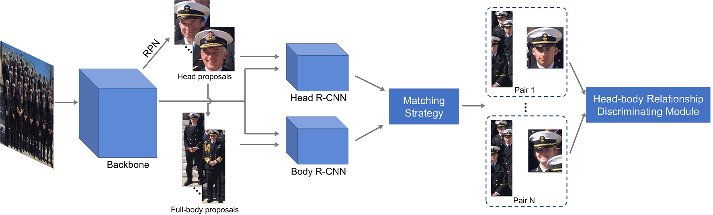

<div align="center">   
  
# Relational Learning for Joint Head and Human Detection
 (AAAI2020)
</div>

[Paper in arXiv](http://arxiv.org/abs/1909.10674)

# Abstract
In this work, we present a novel joint head and human detection network,
namely JointDet, which effectively detects head and human
body simultaneously, aiming at handling issues that head detection is often trapped
in more false positives and performance of human detector frequently drops dramatically in crowd scenes.

# Methods



# Getting Started
- [Installation](docs/install.md)
- [Prepare Dataset](docs/prepare_dataset.md)
- [Run and Eval](docs/run_eval.md)

# Model Zoo

|      Method      | MR(Person) | MR(Head) |                       Config                       |                                                                                         model Download                                                                                          |
|:----------------:|:----------:|:--------:|:--------------------------------------------------:|:-----------------------------------------------------------------------------------------------------------------------------------------------------------------------------------------------:|
| JointDet w/ RDM  |    45.7    |   48.3   | [config](exp_cfg/jointdet/person_head_w_rdm.py)  | [Baidu Cloud](https://pan.baidu.com/s/1_woSuTsLg7Dv4pHdQurEOg?pwd=nm8r) (提取码: nm8r) <br/> [Google Drive](https://drive.google.com/file/d/1fkt-ecAgLSioJUz_pDVr143yFZhdX7lh/view?usp=share_link) |
| JointDet w/o RDM |    46.8    |   48.6   | [config](exp_cfg/jointdet/person_head_wo_rdm.py) | [Baidu Cloud](https://pan.baidu.com/s/1nx_37FnkDDuSkIUo0sSfpw?pwd=n6zg) (提取码: n6zg) <br/> [Google Drive](https://drive.google.com/file/d/1hFbXKmn2tdJ4atW5uCOvo5BykGUdHDNH/view?usp=share_link) |


# Citing JointDet
If this work is helpful for your research, please consider citing:

```
@inproceedings{chi2020relational,
  title={Relational learning for joint head and human detection},
  author={Chi, Cheng and Zhang, Shifeng and Xing, Junliang and Lei, Zhen and Li, Stan Z and Zou, Xudong},
  booktitle={Proceedings of the AAAI Conference on Artificial Intelligence},
  volume={34},
  number={07},
  pages={10647--10654},
  year={2020}
}
```

# Acknowledgement

Many thanks to following open source project:
- [mmdetection](https://github.com/open-mmlab/mmdetection)

